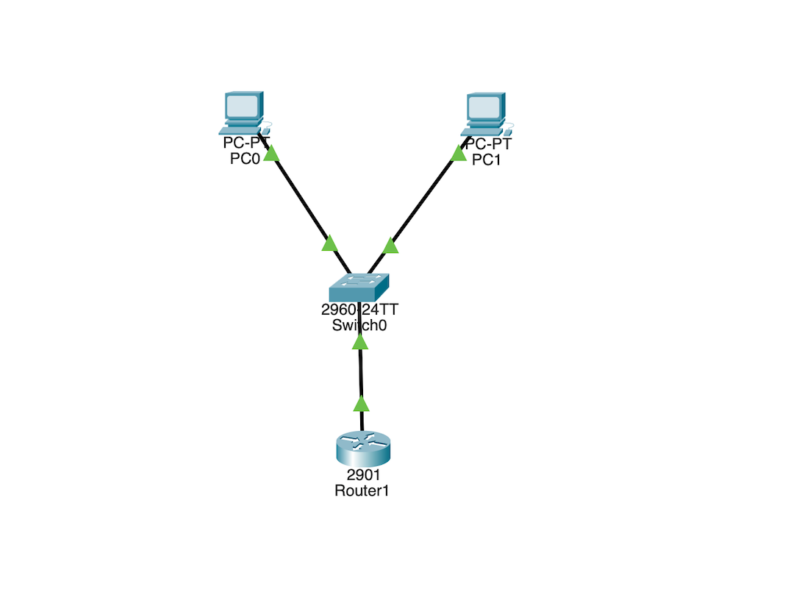

# Small LAN DHCP Lab

This project demonstrates a simple small-office LAN setup using a router, switch, and PCs.  
The router provides DHCP addresses to end devices, and basic connectivity is verified using ping tests.

---

## 🗂 Topology

---

## 🌐 IP Plan
- **Network:** 192.168.10.0/24  
- **Router G0/0:** 192.168.10.1  
- **DHCP Pool:** 192.168.10.50 – 192.168.10.150  
- **Default Gateway:** 192.168.10.1  
- **DNS:** 8.8.8.8

---

## ⚙️ Router Configuration
See **configs/router.txt**

---

## 🔧 Switch Configuration
See **configs/switch.txt**

---

## 🖥 PC Verification (Detailed)

### **PC0 (DHCP Client)**
- Receives IP via DHCP: ✔  
- IP Address: 192.168.10.x  
- Subnet Mask: 255.255.255.0  
- Default Gateway: 192.168.10.1  
- Ping Router: ✔  
- Ping PC1: ✔  

### **PC1 (DHCP Client)**
- Receives IP via DHCP: ✔  
- IP Address: 192.168.10.x  
- Subnet Mask: 255.255.255.0  
- Default Gateway: 192.168.10.1  
- Ping Router: ✔  
- Ping PC0: ✔  

---

## ✅ Verification Summary
- PCs successfully receive IP addresses via DHCP  
- Router provides default gateway + DNS correctly  
- LAN hosts can reach router (Layer 3)  
- LAN hosts can reach each other (Layer 2)  
- Network operates with full end-to-end connectivity  

---

## 📝 Result
LAN successfully configured with DHCP, and all connectivity tests were completed without issues.
