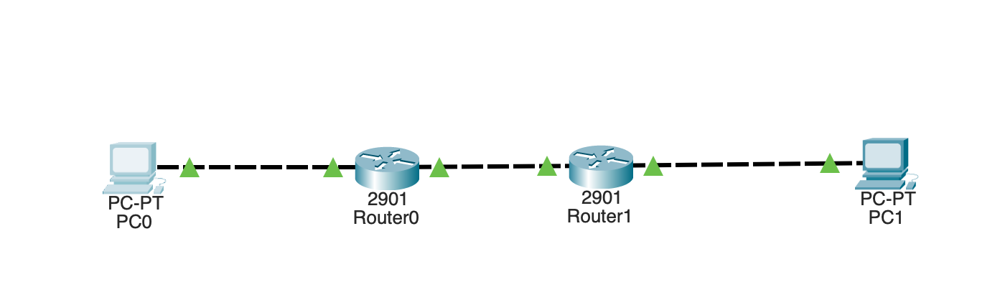

# IPv6 Static Routing Lab

This project demonstrates end-to-end IPv6 communication across two routers using Global Unicast addressing and static routing.

🚀 Goal: Enable IPv6 connectivity between PC0 and PC1.  
🔹 Technologies: IPv6, Static Routing  
🔹 Result: Successful ping between remote networks ✔️

---

